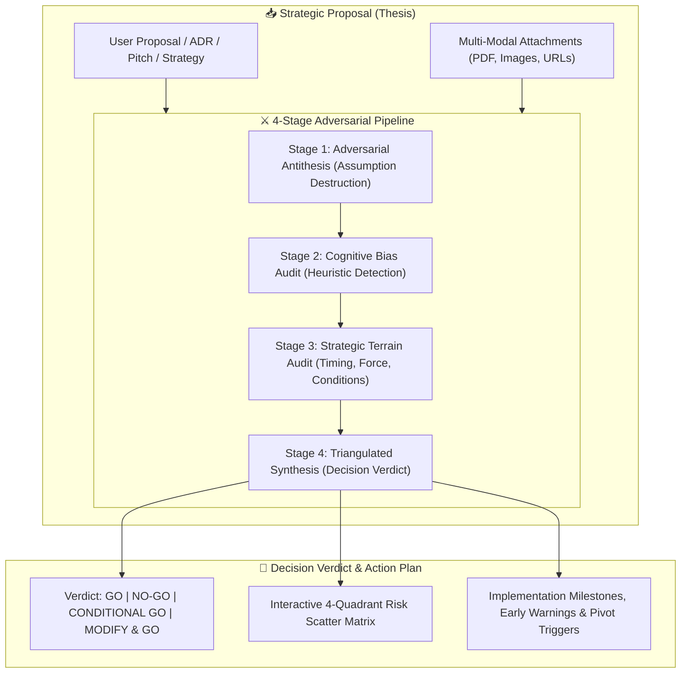
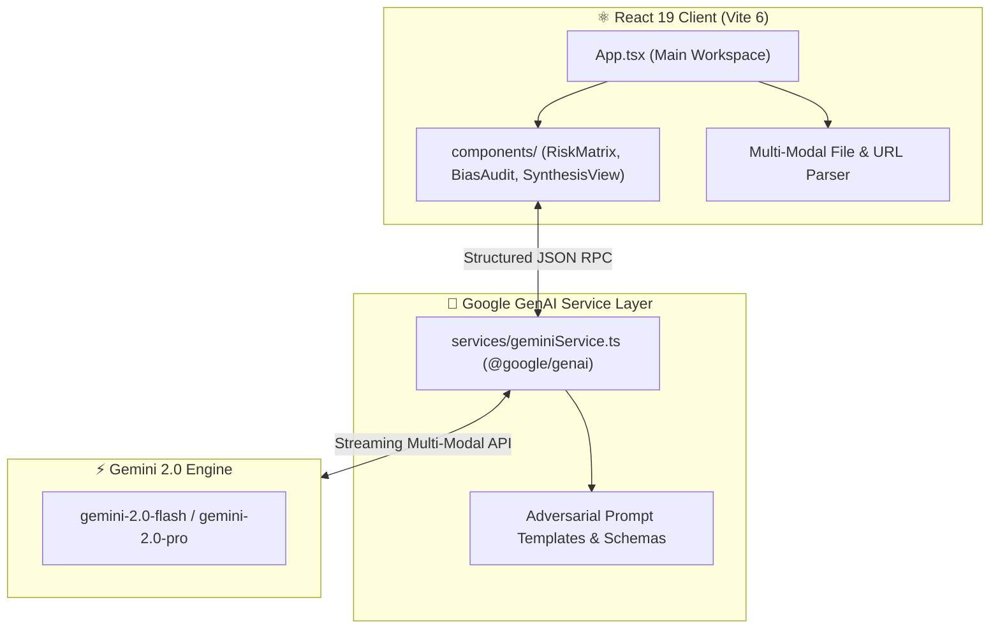

<!-- 😈 DEVIL'S ADVOCATE ARCHITECT — REPOSITORY PRESENTATION (L3 SHOWCASE) -->

<div align="center">


# **😈 Devil's Advocate Architect**

**An adversarial decision-auditing platform, dialectical stress-testing laboratory, and cognitive bias auditor powered by React 19, Google Gemini 2.0/Flash, and Recharts.**

[](#-framework-modes)
[](package.json)
[](tsconfig.json)
[](vite.config.ts)
[](package.json)
[](package.json)
[](LICENSE)
[](https://github.com/traikdude/Devil-s-Advocate-Architect-)

<p align="center">
  <a href="#-overview"><b>Overview</b></a> •
  <a href="#-dialectical-pipeline"><b>Dialectical Pipeline</b></a> •
  <a href="#-framework-modes"><b>Modes</b></a> •
  <a href="#-cognitive-bias-auditing"><b>Bias Audit</b></a> •
  <a href="#-risk-scatter-matrix"><b>Risk Matrix</b></a> •
  <a href="#-architecture--data-flow"><b>Architecture</b></a> •
  <a href="#-quick-start--local-development"><b>Quick Start</b></a> •
  <a href="#-contributing"><b>Contributing</b></a> •
  <a href="#-license"><b>License</b></a>
</p>

</div>

---

## 📑 Table of Contents

- [✨ Overview](#-overview)
- [⚔️ The Dialectical Reasoning Pipeline](#-the-dialectical-reasoning-pipeline)
- [🎛️ Framework Modes](#-framework-modes)
  - [⚡ 1. Quick Adversarial Scan](#1-quick-adversarial-scan)
  - [😈 2. Deep Devil's Advocate](#2-deep-devils-advocate)
  - [🔍 3. Strategic Validation & Bias Audit](#3-strategic-validation--bias-audit)
  - [⚖️ 4. Triangulated Synthesis](#4-triangulated-synthesis)
  - [🏆 5. Full Dialectical Pipeline](#5-full-dialectical-pipeline)
- [🧠 Cognitive Bias Auditing](#-cognitive-bias-auditing)
- [📊 Interactive Risk Scatter Matrix](#-interactive-risk-scatter-matrix)
- [🏗️ Architecture & Data Flow](#-architecture--data-flow)
- [🛠️ Tech Stack](#-tech-stack)
- [⚡ Quick Start & Local Development](#-quick-start--local-development)
- [🗂️ Repository Structure](#-repository-structure)
- [🤝 Contributing](#-contributing)
- [📄 License](#-license)

---

## ✨ Overview

**Devil's Advocate Architect** is an adversarial decision-intelligence studio created to protect leaders, engineers, and autonomous AI agents from groupthink, confirmation bias, blind spots, and catastrophic failure modes.

By orchestrating structured dialectical debate (**Thesis ➔ Antithesis ➔ Synthesis**), the engine takes any strategic proposal, architecture decision record (ADR), investment thesis, or product release plan and subject it to ruthless adversarial stress-testing.

Equipped with **Gemini 2.0 Flash / Pro**, **Recharts 2D Scatter Matrix visualization**, and **Multi-Modal Attachment Ingestion**, Devil's Advocate Architect transforms vague intuition into actionable, risk-calibrated executive verdicts.

---

## ⚔️ The Dialectical Reasoning Pipeline



---

## 🎛️ Framework Modes

The platform supports 5 operational modes tailored to decision velocity and depth:

| Mode | Key Feature | Output Artifacts | Ideal Scenario |
|---|---|---|---|
| ⚡ **Quick Scan** | High-velocity check | Top risk, primary alternative, counter-recommendation | Fast PR reviews, daily operational decisions |
| 😈 **Devil's Advocate** | Deep adversarial attack | Hidden assumption breakdown, failure modes, risk matrix | Product launches, architectural pivots |
| 🔍 **Validation Audit** | Bias & strategic audit | Bias heatmap, Sun Tzu terrain/timing/force assessment | Strategic planning, investments, M&A |
| ⚖️ **Synthesis** | Triangulated integration | Thesis vs Antithesis weighting, definitive verdict | Final go/no-go executive review |
| 🏆 **Full Pipeline** | Complete end-to-end | Comprehensive multi-page risk and implementation dossier | High-stakes, irreversible enterprise decisions |

---

## 🧠 Cognitive Bias Auditing

The validation engine actively audits proposals for systemic psychological biases:

```text
┌────────────────────────────────────────────────────────────────────────┐
│                      COGNITIVE BIAS AUDIT SUITE                        │
├───────────────────────┬────────────────────────┬───────────────────────┤
│ 🎯 Perception Biases  │ ⏳ Temporal & Sunk     │ ⚖️ Framing & Anchoring │
│ • Confirmation Bias   │ • Sunk Cost Fallacy    │ • Framing Effect      │
│ • Overconfidence Bias │ • Planning Fallacy     │ • Anchoring Bias      │
│ • Availability Bias   │ • Recency Bias         │ • Status Quo Bias     │
└───────────────────────┴────────────────────────┴───────────────────────┘
```

---

## 📊 Interactive Risk Scatter Matrix

Powered by **Recharts**, the risk visualizer plots discovered vulnerabilities across a dynamic **Probability (1-10) vs. Impact (1-10)** scatter coordinate system categorized into 4 risk domains:

* 🔴 **Strategic Risks**: Market shifts, competitor reactions, misaligned incentives.
* 🟡 **Operational Risks**: Technical debt, staffing bottlenecks, dependency failures.
* 🟢 **Financial Risks**: Runway depletion, cost overruns, unit economic compression.
* 🟣 **Reputational Risks**: Security vulnerabilities, customer churn, brand damage.

---

## 🏗️ Architecture & Data Flow



---

## 🛠️ Tech Stack

* **Frontend Framework**: React 19 (`react` 19.2.3, `react-dom` 19.2.3)
* **Language & Typing**: TypeScript 5.8.2 (`tsconfig.json`)
* **Build System**: Vite 6.2.0 (`vite.config.ts`)
* **AI Orchestration SDK**: Google GenAI SDK (`@google/genai` 1.38.0)
* **Data Visualization**: Recharts (`recharts` 3.6.0)
* **Iconography**: Lucide React (`lucide-react` 0.562.0)
* **Styling**: Tailwind CSS with custom neon-dark cyberpunk styling

---

## ⚡ Quick Start & Local Development

### Prerequisites
* [Node.js](https://nodejs.org/) (v18+ or v20+)
* [Google Gemini API Key](https://aistudio.google.com/)

### Setup Instructions
1. Clone the repository:
   ```bash
   git clone https://github.com/traikdude/Devil-s-Advocate-Architect-.git
   cd Devil-s-Advocate-Architect-
   ```
2. Install dependencies:
   ```bash
   npm install
   ```
3. Set your Gemini API key in `.env.local`:
   ```bash
   VITE_GEMINI_API_KEY="your-gemini-api-key-here"
   ```
4. Launch the local Vite development server:
   ```bash
   npm run dev
   ```
5. Open `http://localhost:5173` in your browser.

---

## 🗂️ Repository Structure

```text
Devil-s-Advocate-Architect-/
├── docs/                        # Presentation & visual assets
│   └── assets/
│       └── banner.png           # L3 Showcase high-resolution hero banner
├── components/                  # Risk scatter plots, bias meters, synthesis panels
├── services/                    # Google GenAI SDK integration & prompt builders
├── App.tsx                      # Main dialectical studio & state coordinator
├── types.ts                     # TypeScript data contracts & risk schemas
├── index.html                   # Application HTML shell & root mount
├── index.tsx                    # React 19 entrypoint
├── package.json                 # Project dependencies & scripts
├── tsconfig.json                # TypeScript compiler configuration
├── vite.config.ts               # Vite bundler configuration
├── README.md                    # L3 Showcase presentation documentation
└── LICENSE                      # MIT Open Source License
```

---

## 🤝 Contributing

1. Fork the repository and create your branch (`git checkout -b feature/new-bias-detector`).
2. Add new risk metrics or cognitive bias tests in `types.ts` and `services/`.
3. Verify the build compiles without errors: `npm run build`.
4. Submit a Pull Request.

---

## 📄 License

Distributed under the **MIT License**. See [LICENSE](LICENSE) for details.

---

<div align="center">

*Forged for Critical Thinkers, Strategic Planners & Dialectical AI Agents.*  
**Devil's Advocate Architect · React 19 · TypeScript · Google GenAI · Recharts**

</div>
